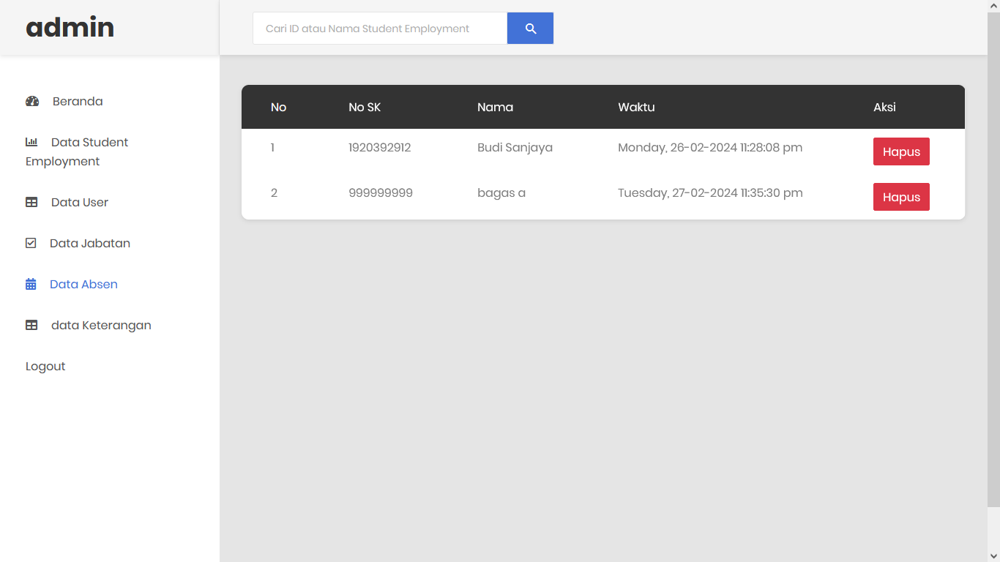

# Absensi Student Employment

Absensi dan Sistem Informasi SE berbasis web

--> Absensi Student Employment

Absen SE - Sistem informasi SE merupakan aplikasi absensi berbasis web, yang dibuat untuk memenuhi kebutuhan museum untuk memudahkan admin dalam mencatat kehadiran SE.

## Fitur - fitur aplikasi :
1. Admin, dimana admin bisa mengontrol aplikasi, ini seperti menambahkan, melihat, mengubah atau menghapus data.

2. Student Employment, sistem ini memungkinkan setiap SE melakukan absensi berdasarkan sesi nya masing - masing. Untuk mencegah penyalahgunaan data.

## Login Account
|   Level   | Username  | Password   |
|:---------:|:---------:|-----------:|
| Admin     | admin     | admin   |
| SE         | user     | user   |

# Tampilan Aplikasi
## Tampilan Homepage

## Tampilan Admin

## Tampilan SE

## Catatan(PENTING) :
<i style="color: yellow;">Sebelum mengimport database, pastikan anda membuat database sesuai dengan nama database yang ada di dalam folder db, yaitu 'absendulu'</i>

---

## Sistem Requirement
- Database MySQL
- XAMPP / PHP 5.6

